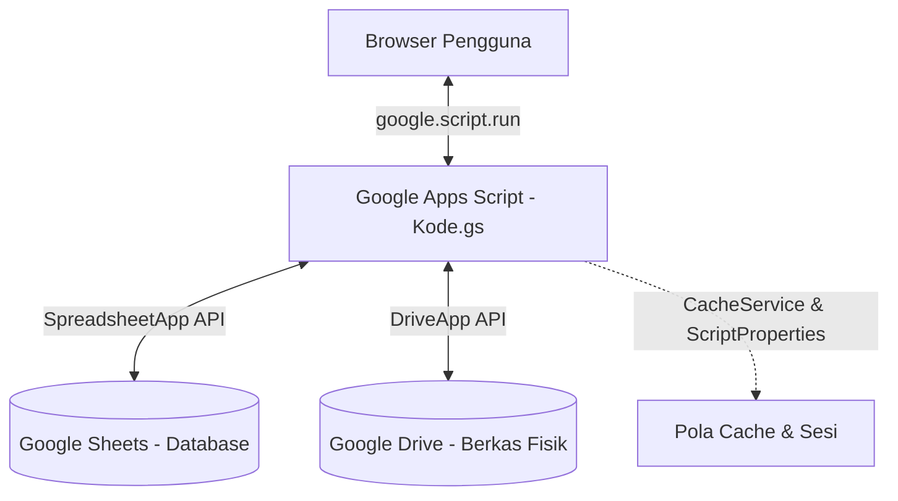

# Panduan Desain & Arsitektur Sistem (DESIGN.md)
*Aplikasi Arsip Balai K3 — Panduan Struktur Data, Arsitektur, dan UI/UX*

Dokumen ini menjelaskan arsitektur sistem, skema database Google Sheets, hierarki penyimpanan Google Drive, panduan desain antarmuka (UI/UX), serta protokol keamanan dan sesi yang digunakan dalam **Aplikasi Arsip Balai K3**.

---

## 1. Arsitektur Sistem

Aplikasi ini menggunakan arsitektur serverless berbasis ekosistem cloud Google:



### Penjelasan Komponen:
1. **Presentation Layer (Frontend):** Berjalan langsung di browser pengguna menggunakan HTML5, Javascript, dan CSS (Tailwind CSS CDN + Custom Vanilla CSS). Menghubungi server Apps Script menggunakan metode asinkron `google.script.run`.
2. **Logic & API Layer (Backend):** Berjalan pada container Google Apps Script (`Kode.gs`). Bertugas memproses perutean halaman, operasi CRUD, interaksi penyimpanan file, dan manajemen ekspor dokumen.
3. **Database Layer (Spreadsheet):** Menyimpan data terstruktur (relasional-like) di dalam berkas Google Sheets.
4. **Storage Layer (Google Drive):** Menyimpan file pindaian/digital dari arsip fisik dalam folder yang terstruktur dengan rapi.

---

## 2. Skema & Struktur Database (Google Sheets)

Database utama disimpan dalam berkas Google Sheets dengan **ID:** `147OCWGJHSlzxt6HiprOsZs6dvdULXeo-4BuhV9qU8yg`. Spreadsheet ini terdiri dari beberapa sheet (tabel):

### A. Tabel `Login` (Kredensial Pengguna)
Digunakan untuk mencocokkan data login pengguna.
- **Baris Header:** Baris 1
- **Kolom Kunci:**
  - `A` / Kolom 1: `NO` (Nomor Urut ID)
  - `B` / Kolom 2: `Username` (Teks, dicocokkan dengan *uppercase*)
  - `C` / Kolom 3: `Password` (Teks, dicocokkan dengan *uppercase*)

### B. Tabel `Database` (Arsip Utama)
Menyimpan data arsip digital utama organisasi.
- **Baris Header:** Baris 1
- **Daftar Kolom (A - P):**
  1. `A` (1): `NO` (Nomor Urut Auto-Increment)
  2. `B` (2): `No. Berkas`
  3. `C` (3): `No. Item Arsip`
  4. `D` (4): `Kode Klasifikasi` (Terhubung dengan sheet `KodeKlasifikasi`)
  5. `E` (5): `Judul` (Deskripsi/Nama Arsip)
  6. `F` (6): `Tanggal Surat` (Format tanggal: `YYYY-MM-DD`)
  7. `G` (7): `Jumlah`
  8. `H` (8): `Tingkat Perkembangan`
  9. `I` (9): `Klasifikasi Keamanan`
  10. `J` (10): `Akses Publik`
  11. `K` (11): `Hak Akses`
  12. `L` (12): `Dasar Pertimbangan`
  13. `M` (13): `Keterangan` (Misal: Folder Data Arsip utama)
  14. `N` (14): `Lokasi`
  15. `O` (15): `No Box`
  16. `P` (16): `Link Tautan` (Tautan file digital di Google Drive)

### C. Tabel `DAFTAR ARSIP ALIH MEDIA` (Alih Media)
Mencatat konversi arsip dari media fisik ke media digital.
- **Baris Header:** Baris 7
- **Awal Data:** Baris 8
- **Daftar Kolom (A - I):**
  1. `A` (1): `No` (Nomor Urut Auto-Increment)
  2. `B` (2): `Jenis Arsip`
  3. `C` (3): `Semula` (Format media asal, misal: Kertas)
  4. `D` (4): `Menjadi` (Format media baru, misal: PDF)
  5. `E` (5): `Jumlah`
  6. `F` (6): `Alat` (Alat pemindai)
  7. `G` (7): `Waktu` (Tanggal konversi)
  8. `H` (8): `Keterangan`
  9. `I` (9): `Link Tautan` (Link Google Drive berkas alih media)

### D. Tabel `DAFTAR SPPD` (Surat Perintah Perjalanan Dinas)
Mengelola daftar surat perintah dinas.
- **Baris Header:** Baris 2
- **Awal Data:** Baris 3
- **Daftar Kolom (A - I):**
  1. `A` (1): `No`
  2. `B` (2): `No. Urut`
  3. `C` (3): `No. SPPD`
  4. `D` (4): `Nama` (Nama Pegawai yang ditugaskan)
  5. `E` (5): `Tujuan Perjalanan Dinas`
  6. `F` (6): `Tempat Tujuan`
  7. `G` (7): `Dari` (Tanggal Mulai Perjalanan - `YYYY-MM-DD`)
  8. `H` (8): `Sampai` (Tanggal Selesai Perjalanan - `YYYY-MM-DD`)
  9. `I` (9): `Tanggal SPPD` (Tanggal Surat Diterbitkan)

### E. Tabel `DAFTAR SURAT MASUK`
Mengelola daftar surat resmi yang masuk ke Balai K3.
- **Baris Header:** Baris 2
- **Awal Data:** Baris 3
- **Daftar Kolom (A - I):**
  1. `A` (1): `No`
  2. `B` (2): `Nomor Urut`
  3. `C` (3): `Nomor Berkas`
  4. `D` (4): `Asal Surat`
  5. `E` (5): `Tanggal Surat` (`YYYY-MM-DD`)
  6. `F` (6): `Nomor Surat`
  7. `G` (7): `Perihal`
  8. `H` (8): `Jenis Surat` (Misal: Undangan, Nota Dinas)
  9. `I` (9): `Link File Tautan` (Link Google Drive file surat masuk)

### F. Tabel `DAFTAR SURAT KELUAR`
Mengelola daftar surat resmi yang dikirim keluar oleh Balai K3.
- **Baris Header:** Baris otomatis (Dynamic Finder `findHeaderRow` atau fallback baris 1-2)
- **Awal Data:** Baris 3
- **Daftar Kolom (A - I):**
  1. `A` (1): `NO`
  2. `B` (2): `Nomor Urut`
  3. `C` (3): `Nomor Berkas`
  4. `D` (4): `Tanggal` (`YYYY-MM-DD`)
  5. `E` (5): `Penerima`
  6. `F` (6): `Perihal`
  7. `G` (7): `Kode Klasifikasi`
  8. `H` (8): `Jenis Surat`
  9. `I` (9): `Link File` (Link Google Drive file surat keluar)

---

## 3. Tata Letak Penyimpanan File (Google Drive Folder Structure)

Berkas digital yang diunggah oleh pengguna akan disimpan secara otomatis di Google Drive di dalam folder utama bernama **"aplikasi arsip"**. Arsitekturnya adalah sebagai berikut:

```text
Google Drive (Akun Admin)
└── aplikasi arsip/
    ├── alih media/                   # Berkas dari formAlipMedia
    ├── Data Arsip/
    │   └── [Keterangan Arsip]/        # Folder dinamis sesuai kolom "Keterangan"
    ├── surat masuk/
    │   └── [Jenis Surat]/            # Folder dinamis sesuai kategori Surat Masuk
    └── surat keluar/
        └── [Jenis Surat]/            # Folder dinamis sesuai kategori Surat Keluar
```

Setiap file yang berhasil diunggah diatur dengan izin publik terbatas via tautan:
- **Hak Akses:** `ANYONE_WITH_LINK` (Siapa saja yang memiliki link)
- **Izin:** `VIEW` (Hanya melihat/mengunduh, tidak bisa mengedit atau menghapus berkas di Drive)

---

## 4. Panduan Visual & Desain Antarmuka (UI/UX)

Aplikasi Arsip Balai K3 mengadopsi standar modern, profesional, dan bersih (*Clean and Corporate UI*).

### A. Palet Warna (Color System)
- **Primary Color:** `#0f2544` (Navy Gelap - memancarkan kesan formal, tepercaya, dan profesional khas kementerian/balai).
- **Secondary/Accent Color:** `#6366f1` (Indigo - digunakan untuk tombol utama, hover states, dan active navigation highlight).
- **Background Utama:** Slate Gray super terang (`#f8fafc` atau `#f1f5f9`).
- **Text Color:** `#1e293b` (Slate gelap untuk tingkat keterbacaan tinggi) & `#64748b` (Slate abu-abu untuk deskripsi sekunder).
- **Status/State Color:**
  - Sukses/Valid: `#10b981` (Hijau Emerald)
  - Peringatan/Hapus: `#ef4444` (Merah Coral)

### B. Tipografi & Font
Menggunakan Google Fonts **"Plus Jakarta Sans"** atau **"Inter"** sebagai font utama keluarga sans-serif demi keterbacaan yang optimal pada perangkat desktop maupun tablet.
Browser default (seperti Arial/Times New Roman) **sangat dihindari** dalam elemen antarmuka apa pun.

### C. Komponen Layout & Layout Grid
- **Sidebar Kiri:**
  - Lebar tetap (`width: 260px` atau fleksibel).
  - Background gelap atau navy dengan kontras tinggi.
  - Berisi logo Balai K3, informasi user aktif, dan menu navigasi.
  - Status aktif menu ditandai dengan perubahan warna latar tombol menjadi aksen indigo.
- **Navbar Atas:**
  - Ketinggian tetap (`height: 70px`), background putih bersih dengan bayangan lembut (`shadow-sm`).
  - Berisi judul halaman saat ini, pintasan profil, dan tombol Logout.
- **Main Area (Konten):**
  - Menggunakan layout *responsive container* dengan padding yang cukup (`p-6` atau `p-8`).
  - Data disajikan di dalam *Card Component* berwarna putih bersih dengan border halus (`border-slate-100`) dan efek bayangan tipis (`shadow-md`).

### D. Interaktivitas & Animasi Mikro
- **Hover Effects:** Semua tombol interaktif wajib memiliki transisi hover yang halus (`transition-all duration-300`). Tombol utama memudar sedikit atau mengalami pergeseran bayangan (*shadow lift*) ketika didekati kursor.
- **Visual Feedback:** Aksi penting (seperti simpan, edit, hapus, logout) wajib menggunakan pustaka dialog **SweetAlert2** (`Swal.fire`) dengan desain minimalis, tidak menggunakan alert javascript bawaan browser yang terkesan kasar.
- **Loading State:** Halaman wajib menampilkan spinner melingkar berputar (`_spin`) yang halus ketika data sedang dimuat dari server Apps Script.

---

## 5. Protokol Keamanan & Manajemen Sesi

Aplikasi mengimplementasikan pertahanan login client-server berbasis sesi transien:

```text
[Client Login Form] ──> checklogin() ──> [Server: Validasi Sheets]
                                              │
  [sessionStorage] <── Simpan Token <── UUID Token dibuat
         │
  [Perpindahan Halaman] ──> cekSesi(Token) ──> [Server: Cek Cache / Properties]
                                                    │
                                         Sesi Valid / Kadaluarsa?
```

1. **Token Sesi:** Saat login berhasil, server menghasilkan token unik menggunakan `Utilities.getUuid()`.
2. **Client Storage:** Token ini disimpan oleh browser di dalam `sessionStorage` dengan nama kunci `_st`. Token ini secara otomatis terhapus saat tab browser ditutup untuk menghindari kebocoran token.
3. **Session Timeout:** Sesi diatur kedaluwarsa secara otomatis dalam **8 Jam** (`SESSION_TIMEOUT = 8 * 60 * 60 * 1000`).
4. **Sliding Session:** Sesi diperbarui secara dinamis di sisi server apabila pengguna aktif berinteraksi dengan jeda waktu lebih dari 10 menit sejak pembaruan terakhir. Ini memastikan pengguna yang terus bekerja tidak tiba-tiba ter-logout sendiri.
5. **Autentikasi Halaman:** Setiap halaman form (`formArsip`, `formSPPD`, dll) menyertakan `session-helper.HTML`. Sebelum merender komponen halaman, script IIFE akan memeriksa token. Jika token tidak ada atau tidak valid di server, pengguna akan dialihkan ke halaman `login` secara instan menggunakan form submit target `_top`.
