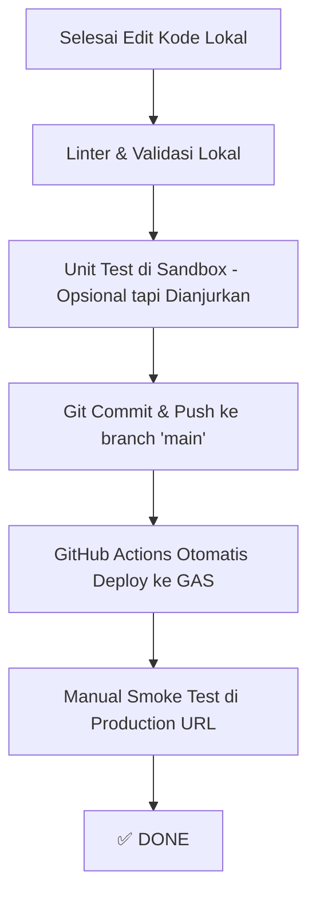

# Panduan Lengkap: Deployment & Testing (End-to-End)

Dokumen ini adalah **Panduan Utama** untuk siapa pun yang telah selesai melakukan perubahan kode (fitur baru, perbaikan bug) dan ingin mengirimkannya ke *production*.

Ikuti alur ini dari atas ke bawah untuk memastikan aplikasi tidak rusak di tangan pengguna.

---

## 🗺️ Ringkasan Alur Kerja



---

## 1. Persiapan: Lingkungan Sandbox (Wajib)

Sebelum menguji atau mengubah apapun yang berinteraksi dengan database (Spreadsheet), Anda **HARUS** menggunakan lingkungan Sandbox.
Aplikasi ini memanipulasi Google Drive dan Google Sheets secara langsung. Kesalahan di tahap *development* bisa menghapus data asli.

1. Buka Spreadsheet Produksi Anda, lalu **Buat Salinan (Make a Copy)**. Ini adalah Spreadsheet Sandbox Anda.
2. Di lingkungan kode lokal Anda (atau editor online), buka file `Kode.gs`.
3. Cari konstanta `SHEET_ID` dan ganti nilainya dengan ID Spreadsheet Sandbox Anda:
   ```javascript
   // GANTI SEMENTARA SELAMA DEVELOPMENT
   const SHEET_ID = 'ID_SPREADSHEET_SANDBOX_ANDA'; 
   ```
4. **PENTING:** Jangan lupa kembalikan `SHEET_ID` ke ID produksi sebelum melakukan `git commit` di akhir sesi.

---

## 2. Unit Testing Lokal (Layer 1)

Kita memiliki kerangka kerja Unit Testing mandiri di dalam Google Apps Script (berada di folder `tests/`). Karena ini di-ignore oleh Clasp, Anda harus menyalinnya ke editor online Anda secara manual.

1. Buka editor skrip Google Apps Script untuk *project sandbox* Anda.
2. Buat file `TestRunner.gs`, `Test_Arsip.gs`, dll. Salin kodenya dari folder lokal `tests/`.
3. Buka `TestRunner.gs` di editor online, ganti `TEST_SHEET_ID` dengan ID Sandbox Anda.
4. Pilih fungsi `runAllTests` dari menu *dropdown* di atas editor, lalu klik **Run**.
5. Cek Log Eksekusi. **Target Anda: 100% Passed.**
   - Jika ada yang `FAIL`, perbaiki `Kode.gs` Anda, dan jalankan tes lagi.

---

## 3. Static Analysis Lokal (Layer 2)

Setelah Anda yakin kodenya bekerja, pastikan tidak ada kesalahan sintaks, format, atau struktur sebelum Anda *commit*.

Buka terminal di komputer Anda (di dalam folder proyek), dan jalankan:
```bash
npm install
npm run lint
npm run validate
```

**Hasil yang diharapkan:**
- Tidak ada error ESLint.
- Pengecekan `npm run validate` menampilkan semua centang hijau (✅ PASS).

> [!WARNING]
> Jika `npm run validate` gagal, pipeline CI/CD (GitHub Actions) akan secara otomatis menolak dan memblokir deployment Anda. Perbaiki *error*-nya sekarang di komputer Anda!

---

## 4. Git Commit & Push (Memicu Deployment)

Pastikan Anda sudah mengembalikan `SHEET_ID` di `Kode.gs` ke ID Spreadsheet Produksi.

Gunakan format pesan *commit* yang deskriptif sesuai aturan [CONTRIBUTING.md](./CONTRIBUTING.md).

```bash
git add .
git commit -m "feat: menambah fitur pencarian tanggal"
git push origin main
```

**Apa yang Terjadi Selanjutnya?**
1. Anda `git push` ke branch `main`.
2. GitHub Actions (terkonfigurasi di `.github/workflows/deploy.yml`) akan terpicu.
3. GitHub Actions akan menjalankan `npm run validate` lagi di cloud.
4. Jika sukses, GitHub Actions akan menggunakan `clasp push` untuk mengunggah kode Anda ke infrastruktur Google.
5. Terakhir, GitHub Actions akan menjalankan `clasp deploy` untuk membuat versi production terbaru, dengan deskripsi sesuai dengan *pesan commit* Anda.

> [!TIP]
> Anda dapat memantau proses deployment ini secara real-time di tab **Actions** pada repository GitHub proyek ini.

---

## 5. Manual Smoke Test (Layer 3 — Wajib di Production)

Meskipun Unit Test dan Linter sudah lolos, Anda **WAJIB** mengecek apakah aplikasi *web* berjalan lancar di URL *production*. Google Apps Script sering mengalami *delay* propagasi atau masalah otorisasi token.

Buka aplikasi versi *production* Anda dan lakukan centang pada daftar pengujian manual ini:

### A. Modul Autentikasi & Sesi
- [ ] Login menggunakan kredensial yang *salah* (harus ditolak).
- [ ] Login menggunakan kredensial yang *benar* (harus berhasil masuk ke Dashboard).
- [ ] Biarkan halaman terbuka tanpa aktivitas > 8 jam, coba navigasi (sesi harus kadaluwarsa, dikembalikan ke halaman login).
- [ ] Klik tombol Logout (sesi terhapus, kembali ke login).

### B. Modul CRUD & Cache
- [ ] **Create:** Tambah 1 Arsip baru. Pastikan nomor terurut dengan benar, dan data muncul di tabel UI.
- [ ] **Read:** Buka tabel Surat Masuk dan Surat Keluar, pastikan data dimuat (*loading* tidak macet).
- [ ] **Update:** Edit arsip yang baru saja Anda buat. Ganti judul/perihal, lalu simpan.
- [ ] **Delete:** Hapus data tersebut.
- [ ] Uji kecepatan (Cache): Refresh tabel berkali-kali. Seharusnya dimuat dengan instan tanpa *loading* panjang (karena `CacheService` bekerja dengan baik).

### C. Modul Integrasi (Google Drive & Export)
- [ ] Buat data baru dan unggah file PDF kecil (< 1MB). Pastikan notifikasi sukses muncul dan file tidak *corrupt* (tautan di tabel bisa dibuka).
- [ ] Buka tab Export (misal SPPD atau tabel lainnya), klik Ekspor ke PDF / Excel. Pastikan file terunduh dengan benar dan formatnya rapi.
- [ ] Hapus data arsip yang berisi PDF tadi. Buka Google Drive secara manual: pastikan file PDF ikut terhapus dari Drive.

---

## 6. Prosedur Darurat: Cara Rollback

Jika *Smoke Test* Anda menemukan *error* fatal di production, dan Anda tidak bisa memperbaikinya dalam waktu 5 menit, **Lakukan Rollback**.

1. Buka [Google Apps Script Dashboard](https://script.google.com).
2. Pilih proyek Anda.
3. Buka **Deploy** > **Manage Deployments**.
4. Di deployment *Active* (URL Production yang biasa Anda bagikan), klik icon **Pencil (Edit)**.
5. Pada dropdown **Version**, pilih nomor versi sebelumnya (angka yang lebih kecil dari yang teratas).
6. Klik **Deploy**.

Aplikasi Anda kini sudah kembali ke versi stabil sebelumnya, tanpa mengubah *URL Web App* pengguna. Anda dapat mulai mencari letak bug secara santai di *branch development* lokal Anda.
