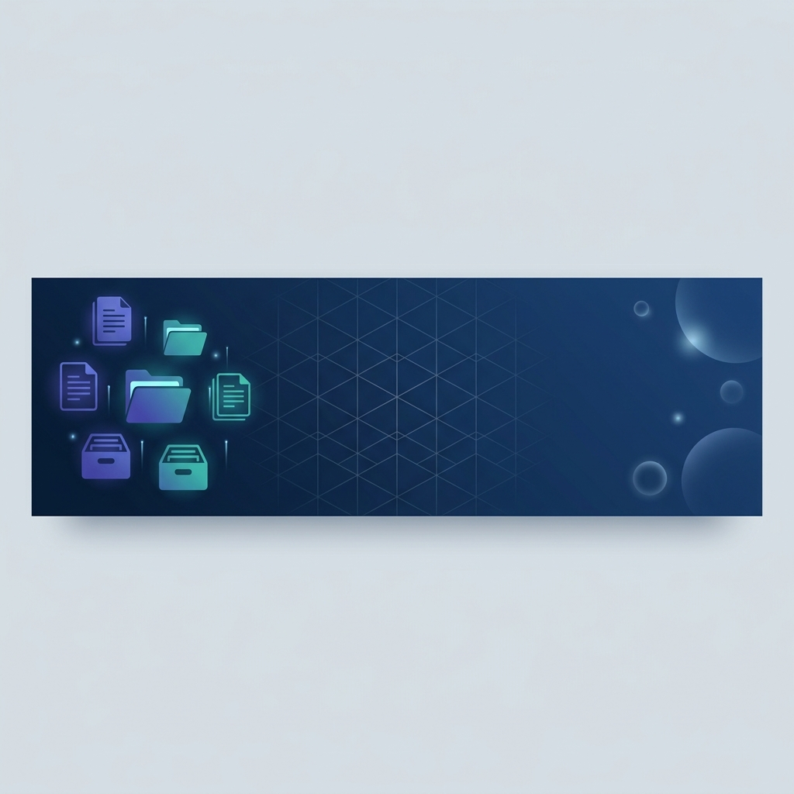

# Aplikasi Arsip Balai K3



Aplikasi Arsip Balai K3 adalah sebuah **Sistem Informasi Kearsipan Digital** berskala instansi yang dirancang secara khusus menggunakan ekosistem *serverless* Google (Google Apps Script, Google Sheets, dan Google Drive). Aplikasi ini dibangun dengan standar arsitektur modern, UI responsif yang elegan (Tailwind CSS), serta keamanan berbasis token transien untuk pengelolaan data kearsipan yang cepat dan andal.

---

## 🌟 Fitur Utama
1. **Manajemen Arsip Utama:** Tambah, edit, hapus, dan cari data arsip dengan performa ultra-cepat berkat dukungan sistem *Cache Layer*.
2. **Arsip Alih Media:** Pencatatan konversi dokumen fisik ke bentuk digital.
3. **Manajemen SPPD (Surat Perintah Perjalanan Dinas):** Form digitalisasi SPPD lengkap dengan otomatisasi ekspor.
4. **Surat Masuk & Surat Keluar:** Sistem *tracking* keluar-masuknya surat beserta lampiran pindaian.
5. **Ekspor Dinamis (PDF/Excel/Word):** Unduh laporan daftar arsip atau SPPD langsung dalam bentuk cetakan PDF, XLSX, atau DOCX.
6. **Integrasi Google Drive Otomatis:** Setiap file pindaian yang diunggah akan otomatis tersimpan dalam hirarki folder rapi di Google Drive.
7. **QR Code Generator/Scanner:** Mudahkan pencarian fisik arsip dengan integrasi QR Code.

---

## 🚀 Teknologi yang Digunakan
- **Frontend:** HTML5, Vanilla JavaScript, CSS (Tailwind CSS CDN).
- **Backend:** Google Apps Script (V8 Engine) bertindak sebagai Web App Controller & API.
- **Database:** Google Sheets (Memanfaatkan `SpreadsheetApp` dan optimasi `CacheService`).
- **Penyimpanan:** Google Drive API.
- **CI/CD:** GitHub Actions & Google Clasp (Deployment otomatis dari repositori).

---

## 📦 Panduan Instalasi (Untuk Pengembang Lokal)

Proyek ini telah dikonfigurasi dengan [Google Clasp](https://github.com/google/clasp) dan mengadopsi struktur CI/CD.

### Prasyarat
1. Telah menginstall Node.js (`v18` atau `v20`).
2. Telah melakukan login `clasp` secara global di mesin Anda (`clasp login`).

### Menarik Kode (Pull)
Buka terminal dan jalankan perintah:
```bash
# Clone repository
git clone <url-repository-anda>
cd aplikasi-arsip

# Instalasi Clasp lokal (opsional jika sudah ada global)
npm install -g @google/clasp

# Unduh versi terbaru dari Google Apps Script
clasp pull
```

### Mengunggah Kode (Deploy via CI/CD)
Proyek ini mengadopsi **Deployment Otomatis**. Anda tidak perlu melakukan `clasp push` secara manual jika ingin memperbarui aplikasi di server *production*:
1. Pastikan fitur/perubahan Anda berjalan dengan baik secara lokal.
2. Lakukan Git Commit dengan pesan yang jelas, contoh: `git commit -m "Memperbaiki tampilan tabel arsip"`.
3. Lakukan `git push origin main`.
4. GitHub Actions akan otomatis melakukan push ke Apps Script dan mencatatkan pesan commit Anda sebagai **Deskripsi Deployment** di riwayat versi Google.

---

## 📚 Dokumentasi Lebih Lanjut
Untuk memahami arsitektur, standar penulisan kode, serta alur kerja aplikasi secara mendalam, kami menyediakan dua panduan khusus:
- 📖 **[DESIGN.md](./DESIGN.md)**: Arsitektur sistem, struktur kolom database (Google Sheets), tata letak penyimpanan Google Drive, dan panduan desain UI/UX.
- 🤖 **[AGENTS.md](./AGENTS.md)**: Panduan kerja *best practice* ekosistem Google Apps Script, dirancang khusus bagi asisten AI dan pengembang lanjutan.

---

*Dikembangkan untuk Balai K3 — Menyederhanakan Kearsipan dengan Kekuatan Cloud.*
